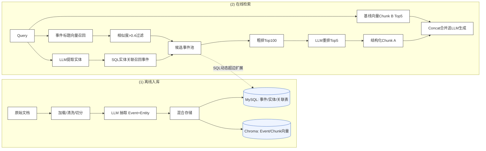

# ai_sag 流程详解

基于 SAG 论文（SQL-Retrieval Augmented Generation with Query-Time Dynamic Hyperedges）的完整流程描述，覆盖**离线建库**和**在线检索**两个阶段，每个步骤对应到具体代码位置。

---

## 一、整体架构

SAG 严格二分：**离线阶段**建轻量索引（不建图谱），**在线阶段**查询时动态生成超边（用完即弃）。ai_sag 完整复刻该结构。



---

## 二、离线建库阶段（Upload）

### 总览

原始文档 → 加载 → 清洗 → 切分 → LLM 抽取（事件+实体）→ 混合存储（MySQL + Chroma）。

**核心原则**：
- Chunk ↔ Event **严格一一对应**（1 个 chunk 抽 1 个融合事件，不拆三元组）
- 实体只做**索引锚点**，不存储完整语义
- 天然支持**增量追加**，新增文档直接追加索引，无需重构

### 步骤 1：文档加载

| 项 | 说明 |
|----|------|
| 位置 | [loader/](file:///d:/ai-llamaindex/ai_sag/loader) |
| 输入 | 文件路径（.md/.txt/.docx/.pdf） |
| 输出 | `LoadedDocument`（含原文 + file_type） |
| 关键点 | 根据扩展名路由到不同 Reader，统一返回结构 |

### 步骤 2：文本清洗

| 项 | 说明 |
|----|------|
| 位置 | [cleaner/](file:///d:/ai-llamaindex/ai_sag/cleaner) |
| 作用 | 去除多余空白、规范化标点、剔除乱码，提升后续切分和抽取质量 |

### 步骤 3：文档切分

| 项 | 说明 |
|----|------|
| 位置 | [splitter/](file:///d:/ai-llamaindex/ai_sag/splitter) |
| 模式 | `auto`（默认）：md→MarkdownNodeParser，其余→SentenceSplitter |
| 参数 | `chunk_size=512`，`chunk_overlap=100` |
| 输出 | `list[Chunk]`（每个含 content/heading/序号） |
| 关键点 | auto 模式按文档类型自适应，只有原生 markdown 才有可靠标题结构 |

### 步骤 4：LLM 抽取事件 + 实体（SAG 核心）

| 项 | 说明 |
|----|------|
| 位置 | [extractor/event_extractor.py](file:///d:/ai-llamaindex/ai_sag/extractor/event_extractor.py) |
| 原则 | **强制单事件**：把 chunk 中所有有效信息融合为**一个综合顶层事件**（不拆三元组，保留完整语义） |
| 实体类型 | 11 类：人物/机构/地点/时间/产品/主题/动作/指标/文件/法规/其他 |
| 跨片段关联 | `extract_batch` 顺序抽取并传递 `previous_context`，解析代词指代 |
| 输出 | 每个 chunk 对应一个 `ExtractedEvent`（含 title/summary/entities） |

### 步骤 5：三库同步存储

| 项 | 说明 |
|----|------|
| 位置 | [ingest/pipeline.py](file:///d:/ai-llamaindex/ai_sag/ingest/pipeline.py) |
| MySQL | `aisag_sources`（文档）/ `aisag_documents`（原文）/ `aisag_chunks`（切片）/ `aisag_events`（事件）/ `aisag_entities`（实体）/ `aisag_event_entities`（多对多关联，**超边底座**） |
| Chroma | 4 个 collection：`event_titles` / `event_contents` / `entities` / `chunks` |
| 增量 | `upsert_source` + `insert_*` 追加写入，不重构全局 |

### 离线阶段流程图

```
原始文档
  │
  ▼
[loader] 加载 → LoadedDocument
  │
  ▼
[cleaner] 清洗 → 干净文本
  │
  ▼
[splitter] 切分 → list[Chunk]（1:N）
  │
  ▼  （严格 1:1）
[extractor] LLM 抽取 → list[ExtractedEvent]（含 title/summary/entities）
  │
  ▼
[ingest/pipeline] 三库同步写入
  ├──→ MySQL：sources/documents/chunks/events/entities/event_entities
  └──→ Chroma：event_titles/event_contents/entities/chunks 向量
```

---

## 三、在线检索阶段（Search）

### 总览

Query → 双路种子召回 → SQL 动态超边扩展 → 粗排 → LLM 重排 → 双路融合 → 生成答案。

**核心原则**：
- 离线零结构，查询时用 SQL Join 动态织网
- 双路并行：SQL 结构化关联（多跳）+ 向量语义（模糊匹配）
- LLM 只做高价值精排，不做低价值召回

### 步骤 1：LLM 提取查询实体

| 项 | 说明 |
|----|------|
| 位置 | [sag_retriever.py:54](file:///d:/ai-llamaindex/ai_sag/retrieval/sag_retriever.py#L54) `_extract_query_entities` |
| 作用 | 用 LLM 从 Query 抽取关键实体名（人名/公司/产品/地点等） |
| 容错 | LLM 失败时退化为正则分词 |

### 步骤 2：双路种子召回（并行）

#### A 路：SQL 结构化实体召回（解决多跳关联）

| 子步骤 | 位置 | 说明 |
|--------|------|------|
| 实体精确名匹配 | [sag_retriever.py:140](file:///d:/ai-llamaindex/ai_sag/retrieval/sag_retriever.py#L140) `search_entities_by_name` | 按名查 entity_id |
| 实体向量扩展 | [sag_retriever.py:142](file:///d:/ai-llamaindex/ai_sag/retrieval/sag_retriever.py#L142) `query_entities` | Query 向量召回相似实体 |
| SQL Join 召回事件 | [sag_retriever.py:66](file:///d:/ai-llamaindex/ai_sag/retrieval/sag_retriever.py#L66) `get_event_ids_by_entity_ids` | 联表查关联事件 → **候选事件集 1** |

#### B 路：事件标题向量召回（解决语义模糊）

| 子步骤 | 位置 | 说明 |
|--------|------|------|
| Query 向量化 | `embedder.embed_text(query)` | — |
| Event 标题向量检索 | [sag_retriever.py:70](file:///d:/ai-llamaindex/ai_sag/retrieval/sag_retriever.py#L70) `query_event_titles` | top_k=100, score>0.4 |
| 过滤 | `similarity_threshold=0.4` | → **候选事件集 2** |

### 步骤 3：合并候选池

| 项 | 说明 |
|----|------|
| 位置 | [sag_retriever.py:76](file:///d:/ai-llamaindex/ai_sag/retrieval/sag_retriever.py#L76) |
| 操作 | `dict.fromkeys(集1 + 集2)` 去重合并 → **总候选事件池** |

### 步骤 4：SQL 动态超边扩展（SAG 最强核心）

| 项 | 说明 |
|----|------|
| 位置 | [sag_retriever.py:114](file:///d:/ai-llamaindex/ai_sag/retrieval/sag_retriever.py#L114) `_expand` |
| 机制 | BFS 逐跳扩展（默认 max_hops=2） |
| 每跳 | 从当前事件反向查关联实体 → 以新实体为桥梁查新事件 → 加入候选池 |
| 底层 | 纯 SQL 联表（`aisag_event_entities`），无图网络、无 PageRank |
| 关键 | **离线无结构，在线动态织网，用完即弃** |

```
种子事件 ──反向查──→ 关联实体 ──正向查──→ 新事件 ──反向查──→ 新实体 ...
   │                    │                  │
   └────────────────────┴──────────────────┴──→ 扩展后事件池
```

### 步骤 5：粗排（事件内容向量相似度）

| 项 | 说明 |
|----|------|
| 位置 | [sag_retriever.py:80](file:///d:/ai-llamaindex/ai_sag/retrieval/sag_retriever.py#L80) `_coarse_rank` |
| 操作 | 用 Query 向量检索 `event_contents` collection，按相似度排序 |
| 截断 | Top-100（`max_events=100`） |

### 步骤 6：LLM 精排

| 项 | 说明 |
|----|------|
| 位置 | [sag_retriever.py:152](file:///d:/ai-llamaindex/ai_sag/retrieval/sag_retriever.py#L152) `_llm_rerank` |
| 操作 | 把 Top-100 事件的标题+摘要喂给 LLM，让其按与 Query 的相关性排序 |
| 截断 | Top-5（`rerank_top_k=5`） |
| 容错 | LLM 失败退化为粗排顺序 |

### 步骤 7：事件回取切片（ChunkA）

| 项 | 说明 |
|----|------|
| 位置 | [sag_retriever.py:168](file:///d:/ai-llamaindex/ai_sag/retrieval/sag_retriever.py#L168) `_sections_for_events` |
| 操作 | Top-5 事件 → 通过 `aisag_events.chunk_id` 映射回原始 Chunk → **结构化 Chunk A** |

### 步骤 8：基线向量召回（ChunkB）

| 项 | 说明 |
|----|------|
| 位置 | [sag_retriever.py:96](file:///d:/ai-llamaindex/ai_sag/retrieval/sag_retriever.py#L96) `_vector_sections` |
| 操作 | Query 向量直接检索 `chunks` collection，Top-5 → **语义基线 Chunk B** |

### 步骤 9：双路融合

| 项 | 说明 |
|----|------|
| 位置 | [sag_retriever.py:99](file:///d:/ai-llamaindex/ai_sag/retrieval/sag_retriever.py#L99) `_merge_dedupe` |
| concat 模式（默认） | ChunkA + ChunkB 拼接去重 |
| supplement 模式 | ChunkA 为主，不足时用 ChunkB 补足 |
| 输出 | 最终上下文切片 |

### 步骤 10：生成答案

| 项 | 说明 |
|----|------|
| 位置 | [retrieval/qa_engine.py](file:///d:/ai-llamaindex/ai_sag/retrieval/qa_engine.py) |
| 操作 | 拼接最终 Chunk 上下文 + Query → 送 LLM 生成答案 |
| 输出 | 答案 + 切片 + trace（含查询实体/种子事件/扩展事件/重排结果） |

### 在线阶段流程图

```
Query
  │
  ├──→ [A路] LLM提取实体 ──→ 实体精确名 + 实体向量扩展 ──→ SQL Join召回事件 ──→ 候选集1
  │
  ├──→ [B路] Query向量化 ──→ Event标题向量检索 ──→ score>0.4过滤 ──→ 候选集2
  │
  ▼
合并候选池（去重）
  │
  ▼
[SQL动态超边扩展] BFS逐跳（默认2跳）：事件↔实体↔新事件
  │
  ▼
[粗排] Event内容向量相似度 Top-100
  │
  ▼
[LLM精排] Top-5事件
  │
  ▼
[事件回取] 映射回Chunk ──→ ChunkA
  │
  ├──→ [基线向量] Query检索Chunk Top5 ──→ ChunkB
  │
  ▼
[双路融合] concat合并去重
  │
  ▼
[LLM生成] 拼接上下文 → 答案
```

---

## 四、关键参数对照（论文推荐值）

| 参数 | 论文值 | ai_sag 默认 | 配置项 |
|------|--------|------------|--------|
| 实体扩展相似度阈值 | 0.9 | 0.9 | `AISAG_ENTITY_EXPAND_THRESHOLD` |
| 事件召回相似度阈值 | 0.4 | 0.4 | `AISAG_SIMILARITY_THRESHOLD` |
| 默认扩展跳数 H | 1 | 2 | `AISAG_MAX_HOPS` |
| 候选事件粗筛数量 | 100 | 100 | `AISAG_MAX_EVENTS` |
| LLM 重排候选上限 | — | 100 | `AISAG_RERANK_CANDIDATE_LIMIT` |
| 边界实体剪枝上限 | — | 100 | `AISAG_ENTITY_FRONTIER_BUDGET` |
| 结构路径输出 Chunk | 5 | 5 | `AISAG_RERANK_TOP_K` |
| 语义基线输出 Chunk | 5 | 5 | `AISAG_MAX_SECTIONS` |
| 融合模式 | concat | concat | `AISAG_FUSION` |

> 注：实体扩展阈值与事件召回阈值已拆分为两个独立参数（`AISAG_ENTITY_EXPAND_THRESHOLD` 和 `AISAG_SIMILARITY_THRESHOLD`），严格对齐论文。
>
> 关于 `max_hops=2`（论文 H=1）：ai_sag 默认 2 跳以增强多跳关联召回能力，适用于跨文档实体关联较多的场景；若数据噪声大或召回精度要求高，可设为 1 对齐论文。

---

## 五、SAG 三大核心创新点对应

| 创新点 | 流程位置 | 代码实现 |
|--------|---------|---------|
| **不建静态图谱** | 离线阶段 | 只建事件-实体多对多索引表，无图网络 |
| **查询时动态超边** | 在线步骤 4 | `_expand` 用 SQL Join 逐跳扩展，用完即弃 |
| **双路融合** | 在线步骤 7-9 | ChunkA（结构化精排）+ ChunkB（向量基线）concat |

---

## 六、工程增强（流程图未画，提升健壮性）

| 增强 | 位置 | 作用 |
|------|------|------|
| fallback 兜底 | [sag_retriever.py:84](file:///d:/ai-llamaindex/ai_sag/retrieval/sag_retriever.py#L84) | 双路召回 0 事件时退化为纯向量检索，保证不返回空 |
| supplement 模式 | [sag_retriever.py:103](file:///d:/ai-llamaindex/ai_sag/retrieval/sag_retriever.py#L103) | 事件回取为主，向量补足兜底 |
| LLM 重排容错 | [sag_retriever.py:166](file:///d:/ai-llamaindex/ai_sag/retrieval/sag_retriever.py#L166) | LLM 失败退化为粗排顺序 |
| trace 全链路追踪 | `SearchTrace` | 记录每步结果，便于调试和可解释性 |
| event_cache 复用 | [sag_retriever.py:103](file:///d:/ai-llamaindex/ai_sag/retrieval/sag_retriever.py#L103) | BFS 阶段查过的事件缓存复用，精排免重复 MySQL 查询 |
| entity_frontier_budget | [sag_retriever.py:273](file:///d:/ai-llamaindex/ai_sag/retrieval/sag_retriever.py#L273) | BFS 每跳边界实体上限=100，防实体爆炸 |
| epollm 子策略 | [sag_retriever.py](file:///d:/ai-llamaindex/ai_sag/retrieval/sag_retriever.py) | 每跳相似度动态停止扩展（替代固定跳数），含 hop_seed_topk 剪枝 |
| B路补偿逻辑 | [sag_retriever.py](file:///d:/ai-llamaindex/ai_sag/retrieval/sag_retriever.py) | A路不足 max_sections 时 B路多取差额 `per_path + 差额` |

这些增强不改变主流程，只提升工业可用性，符合 SAG"工业级落地"定位。